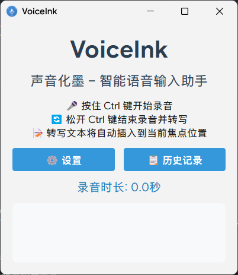

# VoiceInk - 智能语音输入助手 🎙️

VoiceInk 是一款简单易用的智能语音输入工具，支持实时语音转文字，让您的输入更加轻松自如。

## ✨ 主要特性

- 🎯 **便捷操作**：按住 Ctrl 键说话，松开自动转写
- 🚀 **实时转写**：基于大模型的快速准确的语音识别
- 💡 **智能优化**：自动优化转写结果
- 🔄 **历史记录**：支持查看和管理历史记录
- 🎨 **界面美观**：简洁现代的用户界面,支持音频波形图显示
- 🔒 **隐私保护**：本地处理，数据安全
- 🌐 **符号处理**：支持自定义去除句尾符号或emoji表情
- 📦 **便携设计**：绿色免安装，方便快捷

## 🙌 界面截图

### 主界面

### 设置界面

### 历史记录

## 🚀 快速开始

### 下载安装

1. 从 [Releases](https://github.com/BryceWG/VoiceInk/releases) 页面下载最新版本
2. 选择下载方式：
   - 便携版（推荐）：下载 `VoiceInk_便携版.zip`
   - 单文件版：下载 `VoiceInk.exe`
   - 
### 自己打包

1. 安装依赖 `pip install -r requirements.txt`
2. 运行 `build_scripts/build.py` 打包

### 首次使用

1. 解压或运行程序
2. 在设置中配置 API 密钥
3. 按住 Ctrl 键开始录音
4. 等到悬浮窗涟漪动画完成后开始说话
5. 松开 Ctrl 键完成转写

## 💻 使用说明

### 基本操作

- **开始录音**：按住 Ctrl 键
- **结束录音**：松开 Ctrl 键
- **查看历史**：点击系统托盘图标
- **修改设置**：右键系统托盘图标

## ⚙️ 配置说明

### API 设置

首次使用需要配置 API：
- 转录服务 API Key (OpenAI/Groq/SliconFlow(中文用户推荐))
- Siliconflow 服务目前只支持 FunAudioLLM/SenseVoiceSmall 模型,在 custom 模式下使用

### 其他设置

- 语音识别模型选择
- 界面主题设置
- 符号处理设置
- 录音控制设置
- 日志选项
- 波形图位置设置

## 📝 注意事项

- 确保麦克风权限已开启
- 建议使用较安静的环境
- 定期备份历史记录

## 🔄 更新日志

### v1.0.0 (2024-10-24)
- 首个正式版本发布
- 支持实时语音转写
- 支持历史记录管理
- 支持系统托盘操作

## 🤝 贡献指南

欢迎提交 Issue 和 Pull Request！

## 📄 许可证

本项目采用 [MIT 许可证](LICENSE)

---

Made with ❤️ by [BryceWG](https://github.com/BryceWG)
